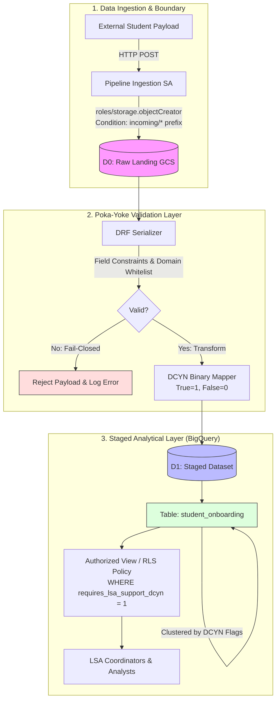
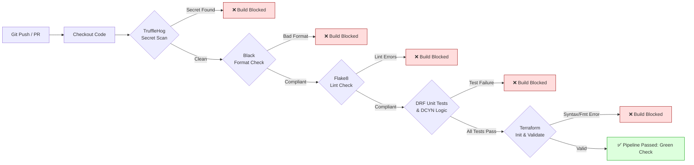

# Habot Secure Cloud: Automated Security & Quality Build Gate (GCP + DevSecOps)

[](https://github.com/PDdogra/habot-secure-cloud/actions/workflows/ci.yml)
[](https://www.terraform.io)
[](https://cloud.google.com)
[](https://www.python.org)
[](https://www.django-rest-framework.org)
[](https://github.com/psf/black)

---

## 📌 Project Overview

**Habot Secure Cloud** is a production-minded cloud data ingestion, governance, and DevSecOps architecture built for student onboarding data. It demonstrates a **"Fail-Closed" security model** across two core pillars:

1. **Infrastructure as Code (Terraform on Google Cloud Platform):** A partitioned, two-tier storage and analytics architecture separating unvalidated landing data (**D0 Raw Landing**) from schema-enforced, analytical data (**D1 Staged/Enforced**), governed by granular IAM conditions, least-privilege service accounts, and Row-Level Security (RLS).
2. **Poka-Yoke DevSecOps Gate (GitHub Actions):** An automated pre-merge/pre-deployment pipeline that intercepts insecure code, leaked credentials, non-compliant formatting, structural defects, and broken data validation logic before any artifact reaches staging or production.

---

## 🎯 Problem Statement

Educational and EdTech data platforms handle sensitive student onboarding information and personally identifiable information (PII). Typical pipeline vulnerabilities include:
- **Overly permissive access:** Ingestion services possessing full read/write/delete access across entire storage buckets.
- **Unvalidated data ingestion:** Corrupted, out-of-range, or malicious payloads polluting analytical databases.
- **Accidental secret exposure:** Hardcoded cloud credentials, tokens, or API keys committed to version control.
- **Inconsistent data representations:** Ambiguous boolean fields causing reporting discrepancies across downstream analytics.

This project addresses these challenges with deterministic **Discrete Condition Yes/No (DCYN)** validation, strict **least privilege IAM**, and **automated fail-closed build gates**.

---

## 🏛 Architecture



### Architectural Tiers:
- **D0 Raw Landing (`habot-508309-d0-raw-landing`):** Isolated Google Cloud Storage bucket acting as an immutable holding zone. Enforces uniform bucket-level access, public access prevention, versioning, and an automated 30-day object deletion lifecycle.
- **D1 Staged / Enforced (`d1_staged_enforced`):** Analytical BigQuery dataset housing only schema-validated and DCYN-transformed records. Direct raw ingestion is disallowed.
- **Row-Level Security (RLS) View (`student_onboarding_lsa_active`):** Enforces query-time filtering so that specialized support staff (e.g. LSA coordinators) only query students flagged for support assistance.

---

## 🔒 Security Architecture & IAM Least Privilege

| Resource | Identity / Principal | Role / Permission | Condition / Security Controls |
| :--- | :--- | :--- | :--- |
| **D0 GCS Bucket** | `habot-pipeline-ingest` Service Account | `roles/storage.objectCreator` | **IAM Condition:** Restricts uploads strictly to `objects/incoming/*`. Cannot read, list, delete, or overwrite. |
| **D0 GCS Bucket** | All Users | `None` | `public_access_prevention = "enforced"`, `uniform_bucket_level_access = true`. |
| **D1 BigQuery Dataset** | Project Owners | `OWNER` | Full administrative control. |
| **D1 BigQuery Dataset** | Analyst (`pranavdograa@gmail.com`) | `READER` | Read-only analytical queries. No table alteration or deletion privileges. |
| **D1 BigQuery Table** | Support Staff | Row-Level Access | Row access filtered via Authorized View (`WHERE requires_lsa_support_dcyn = 1`) and native SQL RLS policy. |

---

## 🛡 Poka-Yoke CI/CD Build Gate

The pipeline implements the **Poka-Yoke (ポカヨケ, "mistake-proofing")** manufacturing principle adapted for modern DevSecOps: **a single defect immediately halts the pipeline ("fail-closed") before code can propagate.**



### Pipeline Quality Checks:
1. **Hardcoded Secret Detection (TruffleHog):** Scans git commits for exposed API keys, private certificates, and credentials.
2. **Deterministic Code Formatting (Black):** Enforces PEP 8 standard formatting with zero tolerance for drift.
3. **Static Syntax Analysis (Flake8):** Scans for critical syntax errors, undefined names, and structural code issues.
4. **Automated Serializer Test Suite (Unittest):** Validates boundary constraints, domain whitelisting, and DCYN transformations.
5. **Infrastructure Validation (Terraform):** Executes `terraform init -backend=false`, `terraform validate`, and `terraform fmt -check` to guarantee IaC integrity.

---

## 📊 Data Validation & DCYN Transformation

Incoming student onboarding payloads are validated using **Django REST Framework (DRF)** in [`serializers.py`](serializers.py):

```python
class StudentOnboardingSerializer(serializers.Serializer):
    student_id = serializers.CharField(max_length=50, required=True)
    first_name = serializers.CharField(max_length=100, required=True)
    last_name = serializers.CharField(max_length=100, required=True)
    age = serializers.IntegerField(min_value=3, max_value=21, required=True)
    has_learning_disability = serializers.BooleanField(required=True)
    guardian_email = serializers.EmailField(required=True)
    requires_lsa_support = serializers.BooleanField(required=True)
```

### Discrete Condition Yes/No (DCYN) Logic
Downstream analytics and machine learning models require deterministic binary representations rather than nullable or variable booleans. The serializer converts conditional attributes into DCYN integers (`1` for Yes, `0` for No):

```python
def to_representation(self, instance):
    ret = super().to_representation(instance)
    ret["has_learning_disability_dcyn"] = 1 if instance.get("has_learning_disability") else 0
    ret["requires_lsa_support_dcyn"] = 1 if instance.get("requires_lsa_support") else 0
    return ret
```

### Validation Guardrails:
- **Age Enforcement:** Restricted strictly between `3` and `21` years.
- **Guardian Email Whitelisting:** Must terminate with approved educational domains (`@gmail.com`, `@habot.io`, `@yahoo.com`, `@outlook.com`).
- **Fail-Closed Missing Fields:** Any omitted attribute triggers immediate rejection with detailed error payloads.

---

## 🧰 Technology Stack

| Domain | Technology | Purpose |
| :--- | :--- | :--- |
| **Cloud Provider** | Google Cloud Platform (GCP) | Cloud infrastructure (GCS, BigQuery, IAM) |
| **Infrastructure as Code** | Terraform 1.5+ / Google Provider ~> 5.0 | Declarative provisioning of buckets, datasets, tables, and IAM |
| **CI/CD & DevSecOps** | GitHub Actions | Automated security and quality validation gate |
| **Secret Scanning** | TruffleHog OSS | Automated detection of committed credentials and keys |
| **Language & Framework** | Python 3.11, Django REST Framework | Schema mapping, payload validation, DCYN transformations |
| **Code Quality** | Black, Flake8 | Automated formatting and static lint analysis |

---

## 📁 Repository Structure

```text
habot-secure-cloud/
├── .github/
│   └── workflows/
│       └── ci.yml                 # Poka-Yoke automated security & quality build gate
├── scripts/
│   └── rls_policy.sql             # BigQuery native Row-Level Security DDL policy
├── .gitignore                     # Prevents tracking credentials, state files, and secrets
├── main.tf                        # Complete GCP Terraform infrastructure (D0, D1, IAM, RLS)
├── serializers.py                 # DRF Student Onboarding Serializer with DCYN logic
├── test_serializers.py            # Local execution & automated unittest test suite
└── README.md                      # Comprehensive project documentation & architecture guide
```

---

## 🧪 Local Testing & Verification

All components can be tested locally before pushing:

### 1. Run Data Validation & Unit Tests
```bash
python test_serializers.py
```
**Expected Output:**
```text
SUCCESS: Payload Validation Passed.
DCYN Transformed Output: {'student_id': 'STU-99412', 'first_name': 'John', 'last_name': 'Doe', 'age': 10, 'has_learning_disability': True, 'guardian_email': 'parent@gmail.com', 'requires_lsa_support': True, 'has_learning_disability_dcyn': 1, 'requires_lsa_support_dcyn': 1}

Running Automated Test Suite...
test_age_boundary_enforcement ... ok
test_email_domain_whitelisting ... ok
test_missing_required_fields ... ok
test_valid_payload_dcyn_negative ... ok
test_valid_payload_dcyn_positive ... ok

Ran 5 tests in 0.006s
OK
```

### 2. Run Code Formatting & Lint Checks
```bash
# Verify formatting compliance
python -m black --check .

# Verify static structure and syntax
python -m flake8 . --count --select=E9,F63,F7,F82 --show-source --statistics
```

### 3. Validate Terraform Infrastructure
```bash
# Initialize local provider plugins (backend-free)
terraform init -backend=false

# Validate HCL syntax and configuration
terraform validate

# Verify code formatting
terraform fmt -check

# Generate dry-run execution plan (6 resources to create)
terraform plan
```

---

## 🚀 Deployment Guide

### Prerequisites
1. Google Cloud SDK (`gcloud`) installed and authenticated:
   ```bash
   gcloud auth application-default login
   ```
2. Set target GCP project:
   ```bash
   gcloud config set project habot-508309
   ```

### Execution Steps
```bash
# 1. Initialize Terraform
terraform init

# 2. Plan infrastructure changes
terraform plan -out=tfplan

# 3. Apply infrastructure (requires active billing account)
terraform apply tfplan
```

> [!NOTE]
> **Environment & Billing Notice:**  
> The Terraform configuration in this repository has been compiled, syntax-validated, and verified locally via `terraform plan` (6 resources to create: GCS bucket, conditional IAM member, ingestion service account, BigQuery dataset, BigQuery table, and BigQuery RLS view). In the current evaluation environment, live provisioning (`terraform apply`) is held pending GCP project billing activation.

---

## ⚠️ Limitations & Future Improvements

1. **Event-Driven Cloud Ingestion:** Currently, payloads are processed via application-level scripts. A natural production extension is deploying a Cloud Function triggered by GCS `google.storage.object.finalize` events to automatically execute validation and load data into BigQuery.
2. **Column-Level Data Masking:** Introduce BigQuery Policy Tags and Data Catalog taxonomies to dynamically mask sensitive fields (such as guardian email) for non-administrative roles.
3. **Secret Management:** Move runtime environment variables and service credentials into GCP Secret Manager with automated key rotation.

---

## 💼 Project Summary

### Professional Description
> **Habot Secure Cloud: Cloud Data Ingestion & DevSecOps Platform**  
> Engineered a secure, automated data ingestion architecture on Google Cloud Platform featuring a two-tier storage topology (GCS D0 Raw Landing to BigQuery D1 Staged/Enforced), governed by least-privilege IAM conditions and BigQuery Row-Level Security. Built a "Fail-Closed" Poka-Yoke CI/CD build gate using GitHub Actions, TruffleHog, Black, and Flake8, accompanied by a deterministic Django REST Framework schema validation module converting conditional student attributes into Discrete Condition Yes/No (DCYN) binary logic.

### Bullets
- **Architected Secure Cloud IaC (GCP & Terraform):** Designed and validated a multi-tier data pipeline on GCP using Terraform, provisioning an immutable GCS raw landing bucket with 30-day automated lifecycle rules, an IAM condition-restricted ingestion service account (`roles/storage.objectCreator` on `incoming/*`), and a BigQuery staging dataset with Row-Level Security (RLS).
- **Built Fail-Closed DevSecOps Gates (GitHub Actions):** Implemented an automated Poka-Yoke CI/CD pipeline enforcing secret scanning (TruffleHog), deterministic code formatting (Black), structural linting (Flake8), and Terraform syntax checks, blocking insecure and non-compliant commits prior to merge.
- **Engineered Data Validation & DCYN Logic (DRF & Python):** Developed a robust Django REST Framework schema validation module with email domain whitelisting and age boundary enforcement, transforming raw boolean attributes into deterministic Discrete Condition Yes/No (DCYN) binary flags for analytical modeling.
- **Enforced Principle of Least Privilege & Data Governance:** Implemented granular RBAC separating unvalidated storage from analytical layers, ensuring zero public ingress, data immutability, and filtered views for sensitive student records.
